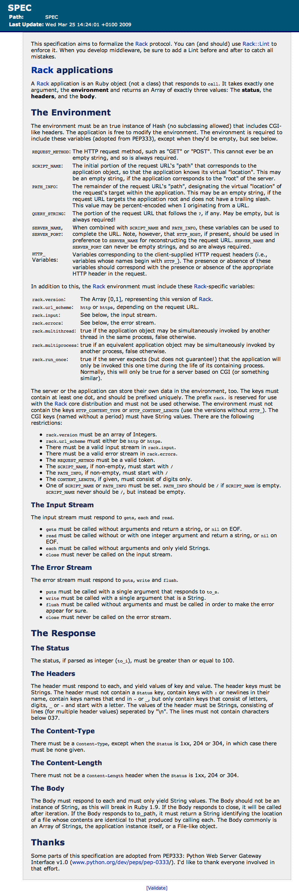

!SLIDE subsection
# Rack

!SLIDE bullets incremental
# What is Rack?

!SLIDE bullets incremental
### It is
* <del>Web Framework</del>
* <del>Web Server</del>
* <del>Library</del> 

!SLIDE bullets incremental
### It is 
* A Convention
* A SPEC, "Just" a document.
* A Interface, Contract, Agreement, Protocol, API
* Conventions for expressing HTTP in Ruby.
* A collection of middlewares
* Based on Python's WSGI.

!SLIDE bullets incremental
### It is
* Interface for web applications servers to run and talk to web applications.

!SLIDE 
### GitHub page says
## Rack provides a minimal, modular and adaptable interface for developing web applications in Ruby. By wrapping HTTP requests and responses in the simplest way possible, it unifies and distills the API for web servers, web frameworks, and software in between (the so-called middleware) into a single method call. ###

!SLIDE center

!SLIDE
## Rack is created by Christian Neukirchen

!SLIDE subsection
# Rack app

!SLIDE bullets incremental
# What is a Rack application?

!SLIDE
###A Rack application is an Ruby object (not a class) that responds to call. It takes exactly one argument, the environment and returns an Array of exactly three values: The status, the headers, and the body.###

!SLIDE subsection
# Rack SPEC

!SLIDE bullets incremental smaller

## Rack SPEC
* It's pretty nice

!SLIDE center full-page

!SLIDE center
### Do read Rack SPEC.

!SLIDE subsection
# Rack app examples
    
!SLIDE smaller
    
    @@@ruby
    # Valid Rack application
    
    class HelloWorld
      def call(env)
        [ 200, 
          {"Content-Type" => "text/html"}, 
          ["Hello World!"]
        ]
      end
    end
    
!SLIDE smaller

    @@@ruby
    # Valid Rack application

    lambda { |env| [ 200, 
                     {"Content-Type" => "text/html"}, 
                     ["Hello World"] 
                   ] 
           }    

!SLIDE smaller
    
    @@@ruby
    def my_method(env)    
      [ 200, 
        {"Content-Type" => "text/html"}, 
        ["Hello World"]
      ]      
    end
    

    # Valid Rack application
    
    my_app = method(:my_method)

    env = { }

    my_app.call(env)
    

!SLIDE code smaller 
     
    /* http://gist.github.com/388288 by @lifo */
    
    /* Valid Rack application */
    
    #include "ruby.h"

    VALUE method_call(VALUE self, VALUE env) {
      VALUE response = rb_ary_new();

      VALUE headers = rb_hash_new();
      rb_hash_aset(headers, rb_str_new2("Content-Type"), rb_str_new2("text/html"));

      rb_ary_push(response, INT2NUM(200));
      rb_ary_push(response, headers);
      rb_ary_push(response, rb_str_new2("Hello Rock"));
      return response;
    }

    void Init_rock() {
      VALUE Rock = rb_define_class("Rock", rb_cObject);
      rb_define_method(Rock, "call", method_call, 1);
    }
    
!SLIDE smaller
    
    @@@ruby
    require 'rock'
    require 'rubygems'
    require 'rack'
    require 'thin'

    Rack::Handler::Thin.run Rock.new, :Port => 9292
    
!SLIDE subsection
# Rack +
    
!SLIDE bullets
## What Rack additionally provides

!SLIDE 
### Rack::Request, which also provides query string parsing and multipart handling 

!SLIDE 
### Rack::Response, for convenient generation of HTTP replies and cookie handling

!SLIDE
### Rack::MockRequest and Rack::MockResponse for efficient and quick testing of Rack application without real HTTP round-trips

!SLIDE
### Rack Handlers for different web servers. e.g. Rack::Handler::Thin.

!SLIDE 
### Rack::Builder, which implements a small DSL to iteratively construct Rack applications.

!SLIDE
### Rack::URLMap, an extremely easy way to combine different web applications with

!SLIDE
### Rack::CommonLogger, for creating Apache-style logfiles.

!SLIDE
### Rack::ShowException, for catching unhandled exceptions and presenting them in a nice and helpful way with clickable backtrace.

!SLIDE
### Rack::File, for serving static files.

!SLIDE 

### rackup, a useful tool for running Rack applications, which uses the Rack::Builder DSL to configure middleware and build up applications easily.

!SLIDE
### Middlewares, introduces a concept of middlewares, which is in between servers and applications.

!SLIDE
### …many others!

!SLIDE subsection
# Basically

!SLIDE smbullets incremental
* for want of a better term, rack is "middleware" between servers and applications/frameworks), rack services a number of concerns
* server abstraction (handlers)
* request abstraction (server env -> hash) (happens in handlers, required by spec)
* response abstraction (tuples, by spec)
* utilities (Rack::Request, Rack::Response, Rack::Utils)
* common usage patterns (default middlewares)
* sane defaults (most handlers add Rack::ContentLength to the middleware stack)
* configuration convention (.ru files eval'd into Rack::Builder instances)
* quick development procedures (rackup)