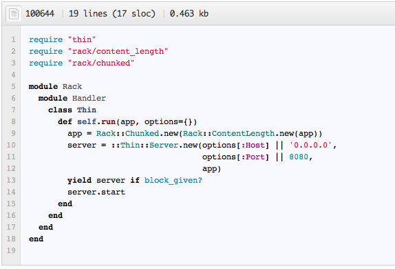

!SLIDE subsection
# Details

!SLIDE bullets incremental small
# Rack::Handler

* Handlers connect web servers with Rack.
* Handlers run applications when they are called with environment headers/hash
* Rack includes Handlers for Thin, Mongrel, WEBrick, FastCGI, CGI, SCGI and LiteSpeed.
* Any valid Rack app will run the same on all these handlers, without
changing anything.  

!SLIDE full-page center
### Rack Handler for Thin Server

!SLIDE ruby smaller
    @@@ruby 
    require 'rubygems'
    require 'rack'

    app = lambda { |env| [ 200, 
                           {"Content-Type" => "text/html"}, 
                           ["Hello World"]
                         ]
                 }

    Rack::Handler::Thin.run app
    
!SLIDE ruby smaller
    @@@ruby 
    require 'rubygems'
    require 'rack'

    app = lambda { |env| [ 200, 
                           {"Content-Type" => "text/html"}, 
                           ["Hello World"]
                         ]
                 }

    Rack::Handler::Mongrel.run app
    
!SLIDE ruby smaller
    @@@ruby 
    require 'rubygems'
    require 'rack'

    app = lambda { |env| [ 200, 
                           {"Content-Type" => "text/html"}, 
                           ["Hello World"]
                         ]
                 }

    Rack::Handler::CGI.run app
