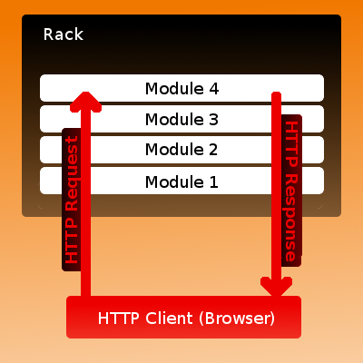

!SLIDE subsection
# Middlewares

!SLIDE bullets incremental small
### <del>Rack::Middleware</del>
# Rack Middlewares

* It is a way to filter a request and response coming into your application
* It’s used to group and order modules (middlewares), which are usually Ruby classes, and specify dependency between them. Rack::Builder puts these modules on top of each other, creating stack-like structure of final web application.

!SLIDE center small
# Rack Middlewares

!SLIDE code smaller
## Rack::ETag

    @@@ruby
    require
'digest/md5' 
    module Rack 


      class ETag 




        def initialize(app) 






          @app
=
app 




        end
        
    
 

def call(env) 






          status, headers, body = @app.call(env) 
          if !headers.has_key?('ETag') 








            parts = [] 








            body.each { |part| parts << part.to_s } 








            headers['ETag']
=

              %("#{Digest::MD5.hexdigest(parts.join(""))}") 








            [status,
headers,
parts] 






          else 








            [status, headers, body] 






          end 




        end 


      end 
    end

!SLIDE smbullets incremental
## Types of middlewares
* Content Modifying - Rack::ContentLength, Rack::Head
* Behavioral - Rack::CommonLogger, Rack::Reloader etc.
* Routing - Rack::URLMap, Rack::Cascade, Rack::Static etc.
* ...

!SLIDE
## Some useful Middlewares

!SLIDE smbullets incremental
## Rack::Throttle
* http://datagraph.rubyforge.org/rack-throttle/

!SLIDE smbullets incremental
## Rack::Cache
* http://datagraph.rubyforge.org/rack-throttle/

!SLIDE smbullets incremental
##  Rack::Auth::Basic
* It comes with Rack 

!SLIDE smbullets incremental small
## Rack::Session::Cookie
    
    @@@ruby 
    use Rack::Session::Cookie, :key => 'rack.session',
                               :domain => 'foo.com',
                               :path => '/',
                               :expire_after => 2592000,
                               :secret => 'change_me'

* It Comes with Rack

!SLIDE smbullets incremental small

## Rack::Reloader
* Rack::Reloader checks on every request, but at most every <secs> seconds, if a file loaded changed, and reloads it, logging to rack.errors.
* It comes with Rack

!SLIDE smbullets incremental small
## Rack::Bug
* http://github.com/brynary/rack-bug/

!SLIDE smbullets incremental small
## Rack::MailExceptions 
* http://github.com/rack/rack-contrib

!SLIDE smbullets incremental small
## Misc Middlewares
* Rack::Profiler – Uses ruby-prof to measure request time.
* Rack::Sendfile – Enables X-Sendfile support for bodies that can be served from file.
* Rack::Deflater – gzip your responses.
* Rack::Head – Drop the body of the response on HEAD requests.
* ...

!SLIDE smbullets incremental
##Rack::Contrib
* http://github.com/rack/rack-contrib 
* Contributed Rack Middleware and Utilities

!SLIDE
###coderack.org

